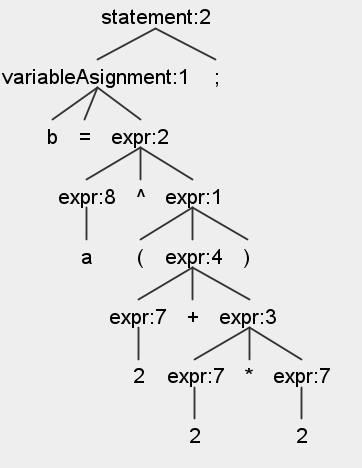

# AMMScript
**Autorzy:**
 *Anna Jochymczyk*,
 *Monika Halek*,
 *Michał Karpierz*

## Założenia programu
AMM Script został stworzony z myślą o prostocie i intuicyjności, aby umożliwić łatwą naukę programowania nawet początkującym. Zestawiając najlepsze cechy dwóch popularnych języków - Pythona i C, AMM Script oferuje harmonijne połączenie elastyczności Pythona z efektywnością i strukturą C. AMM Script stawia sobie za cel zminimalizowanie frustracji początkujących programistów poprzez zapewnienie wsparcia w obsłudze błędów za pomocą jasnych komunikatów. Dodatkowo, automatyczne uzupełnianie nawiasów oraz aktywne monitorowanie składni poprzez odpowiednie podkreślenia mają na celu ułatwienie nauki poprzez zapewnienie wsparcia w trakcie pisania kodu.

**Języki implementacji:**
- Backend w AMM Script oparty jest głównie na języku Python, z dodatkowym wsparciem ANTLR i JavaScript w kontekście rozwoju.
- Do budowy interfejsu użytkownika wykorzystano CSS oraz TypeScript, który bazuje na JavaScript, we współpracy z frameworkiem Next JS.

**Sposób realizacji skanera/parsera**
- W projekcie skaner oraz parser zostały zaimplementowane przy użyciu generatora parserów ANTLR 4. Błędy w czasie wykonania obsługiwane są w trakcie przechodzenia po drzewie semantycznym [w visitor](https://github.com/ShatterPlayer/AMMScript/blob/master/AMMScriptParserVisitor.py).
  
## Opis tokenów
```
lexer grammar AMMScriptLexer;

// Białe znaki:
WHITESPACE: [ \t\r\n]+ -> skip;
// Słowa kluczowe:
SET: 'set';
PRINT: 'print';
IF: 'if';
ELSE: 'else';
FOR: 'for';
WHILE: 'while';
FUNCTION: 'func';
RETURN: 'return';
BREAK: 'break';
CONTINUE: 'continue';
SWITCH: 'switch';
CASE: 'case';
DEFAULT: 'default';

// Operatory porównania:
EQUAL_EQUAL: '==';
NOT_EQUAL: '!=';
LESS: '<';
GREATER: '>';
LESS_EQUAL: '<=';
GREATER_EQUAL: '>=';

// Operatory przypisania:
EQUAL: '=';
PLUS_EQUAL: '+=';
MINUS_EQUAL: '-=';
MULTIPLY_EQUAL: '*=';
DIVIDE_EQUAL: '/=';

// Operatory arytmetyczne:
PLUS: '+';
MINUS: '-';
MULTIPLY: '*';
DIVIDE: '/';
POWER: '^';
MODULO: '%';

// Nawiasy:
LPAREN: '(';
RPAREN: ')';
LBRACE: '{';
RBRACE: '}';
LBRACKET: '[';
RBRACKET: ']';
// Stałe:
NUMBER: ('-')?[0-9]+ ('.' [0-9]+)?;
STRING: '"' (~["\r\n])* '"';
// Typy logiczne
TRUE: 'true';
FALSE: 'false';
// Operatory logiczne
AND: '&&';
OR: '||';
NOT: '!';

// Komentarz:
COMMENT: '#' ~[\r\n]* -> skip;
// Inne znaki:
COMMA: ',';
SEMICOLON: ';';
COLON: ':';

// Identyfikator:
ID: [a-zA-Z_][a-zA-Z0-9_]*;
```
## Gramatyka formatu
```
parser grammar AMMScriptParser;
options {
	tokenVocab = AMMScriptLexer;
}

program: statement* EOF;

statement:
	variableDeclaration SEMICOLON
	| variableAsignment SEMICOLON
	| print SEMICOLON
	| functionCall SEMICOLON
	| expr SEMICOLON
	| if
	| loop
	| functionDeclaration
	| switch;

statementInLoop:
	variableDeclaration SEMICOLON
	| variableAsignment SEMICOLON
	| print SEMICOLON
	| functionCall SEMICOLON
	| expr SEMICOLON
	| ifInLoop
	| loop
	| BREAK
	| CONTINUE
	| switch;

statementInFunction:
	variableDeclaration SEMICOLON
	| variableAsignment SEMICOLON
	| print SEMICOLON
	| functionCall SEMICOLON
	| expr SEMICOLON
	| ifInFunction
	| loopInFunction
	| RETURN expr SEMICOLON
	| switchInFunction;

statementInFunctionAndLoop:
	variableDeclaration SEMICOLON
	| variableAsignment SEMICOLON
	| print SEMICOLON
	| functionCall SEMICOLON
	| expr SEMICOLON
	| ifInFunctionAndLoop
	| loopInFunction
	| BREAK
	| CONTINUE
	| RETURN expr SEMICOLON;

variableDeclaration: SET ID ((EQUAL expr) | (LBRACKET NUMBER RBRACKET EQUAL LBRACKET (expr (COMMA expr)*)? RBRACKET));
variableAsignment:
	ID (LBRACKET expr RBRACKET)? (
		EQUAL
		| PLUS_EQUAL
		| MINUS_EQUAL
		| MULTIPLY_EQUAL
		| DIVIDE_EQUAL
	) expr;

print: PRINT expr;

if:
	IF expr LBRACE statement* RBRACE (
		ELSE IF expr LBRACE statement* RBRACE
	)* (ELSE LBRACE statement* RBRACE)?;

ifInLoop:
	IF expr LBRACE statementInLoop* RBRACE (
		ELSE IF expr LBRACE statementInLoop* RBRACE
	)* (ELSE LBRACE statementInLoop* RBRACE)?;

ifInFunction:
	IF expr LBRACE statementInFunction* RBRACE (
		ELSE IF expr LBRACE statementInFunction* RBRACE
	)* (ELSE LBRACE statementInFunction* RBRACE)?;

ifInFunctionAndLoop:
	IF expr LBRACE statementInFunctionAndLoop* RBRACE (
		ELSE IF expr LBRACE statementInFunctionAndLoop* RBRACE
	)* (ELSE LBRACE statementInFunctionAndLoop* RBRACE)?;

loop: forLoop | whileLoop;

loopInFunction: forLoopInFunction | whileLoopInFunction;

forLoop:
	FOR variableDeclaration SEMICOLON expr SEMICOLON variableAsignment LBRACE statementInLoop*
		RBRACE;

forLoopInFunction:
	FOR variableDeclaration SEMICOLON expr SEMICOLON variableAsignment LBRACE
		statementInFunctionAndLoop* RBRACE;

whileLoop: WHILE expr LBRACE statementInLoop* RBRACE;

whileLoopInFunction:
	WHILE expr LBRACE statementInFunctionAndLoop* RBRACE;

switch:
	SWITCH expr LBRACE (
		CASE expr COLON statement* (BREAK SEMICOLON)?
	)* (DEFAULT COLON statement* (BREAK SEMICOLON)?)? RBRACE;

switchInFunction:
	SWITCH expr LBRACE (
		CASE expr COLON statementInFunction* (BREAK SEMICOLON)?
	)* (DEFAULT COLON statementInFunction* (BREAK SEMICOLON)?)? RBRACE;

functionDeclaration:
	FUNCTION ID LPAREN (
		ID (EQUAL expr)? (COMMA ID (EQUAL expr)?)*
	)? RPAREN LBRACE statementInFunction* RBRACE;

functionCall: ID LPAREN (expr (COMMA expr)*)? RPAREN;

arrayExpr: ID LBRACKET expr RBRACKET;

expr:
	LPAREN expr RPAREN # exprParenthesis
	| expr POWER expr # exprPower
	| expr op=(MULTIPLY | DIVIDE | MODULO) expr # exprMultDivMod
	| expr op=(PLUS | MINUS) expr # exprPlusMinus
	| expr op=(
		EQUAL_EQUAL
		| NOT_EQUAL
		| LESS
		| GREATER
		| LESS_EQUAL
		| GREATER_EQUAL
	) expr # exprComparison
	| expr op=(AND | OR) expr # exprAndOr
	| NUMBER # exprNumber
	| STRING # exprString
	| TRUE # exprTrue
	| FALSE # exprFalse
	| functionCall # exprFunctionCall
	| arrayExpr # exprArray
	| ID # exprId;
```

## Stosowane narzędzia i biblioteki

### Generatory skanerów/parserów
- **ANTLR 4:** Wykorzystano generator parserów ANTLR 4 do implementacji skanera i parsera.

### Pakiety zewnętrzne
- **React:** Do budowy interfejsu użytkownika wykorzystano bibliotekę React.
- **Next.js:** Framework Next.js został użyty w celu zapewnienia struktury aplikacji oraz renderowania na poziomie serwera.
- **TypeScript:** Do typowania statycznego wykorzystano TypeScript, który bazuje na JavaScript.
- **CSS:** Do stylizacji interfejsu użytkownika wykorzystano język CSS.

## Uruchomienie
### Instalacja ANTLR4
Szczegółowe informacje [tutaj](https://github.com/antlr/antlr4-tools/tree/master).

Na Windowsie można zainstalować przez `pip`:

```
  pip install antlr4-tools
```

> [!WARNING]
> Nie zawsze samo wywołanie powyższej komendy wystarczy.

### Generacja drzewa składniowego
```
antlr4-parse AMMScriptLexer.g4 AMMScriptParser.g4 program -gui
```

Potem można wpisać program do konsoli i zakończyć CTRL + Z.

Alternatywnie można uruchomić program z pliku:
```
antlr4-parse AMMScriptLexer.g4 AMMScriptParser.g4 program -gui program.amm
```

### Generacja kodu źródłowego
```
antlr4 -Dlanguage=Python3 .\AMMScriptLexer.g4 .\AMMScriptParser.g4 -o .\antlr\ -no-listener -visitor
```

### Uruchomienie aplikacji webowej

Należy pamiętać o uruchomieniu:
```
python interpretation_api.py ammscript.py
```

Kolejnym krokiem jest wpisanie w terminalu:
```
npm run dev
```
Pojawi się wtedy link http://localhost:3000, jeśli się go kliknie będzie widać poniższą stronę:
(podgląd)


## Przykłady
Przykładowy program w języku AMMScript znajduje się w pliku `program.amm` (nie ma on sensu z logicznego punktu widzenia, służy tylko do prezentacji struktur dostępnych w języku).

Przykładowe drzewo składniowe dla wyrażenia `b = a^(2+2*2);` wygenerowane jedną z powyższych komend w sekcji [generacja drzewa składniowego](#generacja-drzewa-składniowego):



W pliku [Tests.py](https://github.com/ShatterPlayer/AMMScript/blob/master/Tests.py) znajdują się testy zawierające kod napisany w języku AMM Script, które pomogą lepiej zrozumieć działanie tego języka:
```
        set x = 2;
        switch (x) {
            case 1:
                x = 10;
                break;
            case 2:
                x = 20;
                break;
            default:
                x = 0;
        }
        print x;
```
Powinno wypisać: 20

